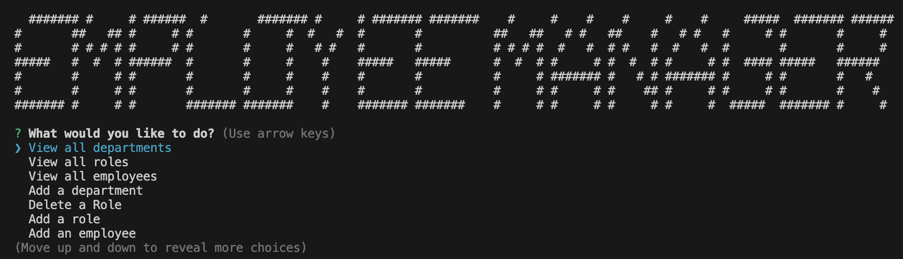

For more information on MIT visit https://opensource.org/licenses/MIT

# Employee Manager
This Employee Management App is a command-line application built using Node.js, Inquirer, and MySQL. The primary goal of this application is to provide an efficient way for developers to manage a company's employee database. It accomplishes this by offering a user-friendly interface to interact with and manipulate the database's information, all from the command line.

## Table of Contents
* [Installation](#installation)
* [Usage](#usage)
* [Contribute](#contribute)
* [License](#license)
* [Tests](#tests)
* [Features](#features)
* [Contributors](#contributors)
* [Questions](#questions)

## Installation

Clone this repository to your local machine, or download the zip file.

## Usage
1. Navigate to the project folder and run npm install to install the necessary dependencies.
2. Ensure you have MySQL2 installed and running, as the app interacts with a MySQL database.
3. Run the app using the command node index.js.
4. Follow the prompts in the command-line interface to manage the employee database.

## Contribute
Fork or clone the repository then make a commit.

## License

MIT License

Permission is hereby granted, free of charge, to any person obtaining a copy
of this software and associated documentation files (the "Software"), to deal
in the Software without restriction, including without limitation the rights
to use, copy, modify, merge, publish, distribute, sublicense, and/or sell
copies of the Software, and to permit persons to whom the Software is
furnished to do so, subject to the following conditions:

Copyright (c) 2023 Daniel Zarate

## Tests
n/a

# Features
* The app utilizes the Inquirer package (version 8.2.4) to create an interactive and intuitive command-line interface. This makes it easy for both technical and non-technical users to navigate and perform database operations.
* The app enables users to manage roles and departments within the company. This includes adding new roles and departments, as well as modifying existing ones.
* Users can view and update various details related to employees, including their roles, departments, and salaries. This simplifies the process of keeping employee records accurate and up to date.

# Contributors

ASK BCS - (tutor and help):
Shoutout to them because they helped massively. Helped with mysql debugging and function errors.

## Questions
Github: https://github.com/Ch40s1

Email: zaratedaniel67@gmail.com email me for any questions.

Video Walkthrough: https://drive.google.com/file/d/1RWKd2CveE1e-XlbzJkkXiGRPdeAeWreF/view
